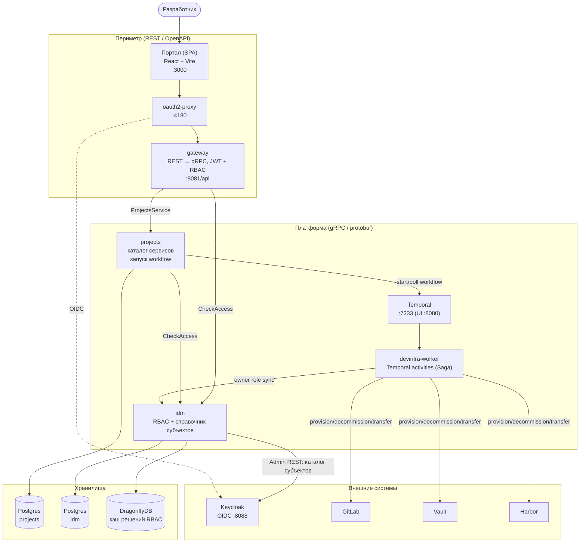
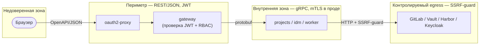
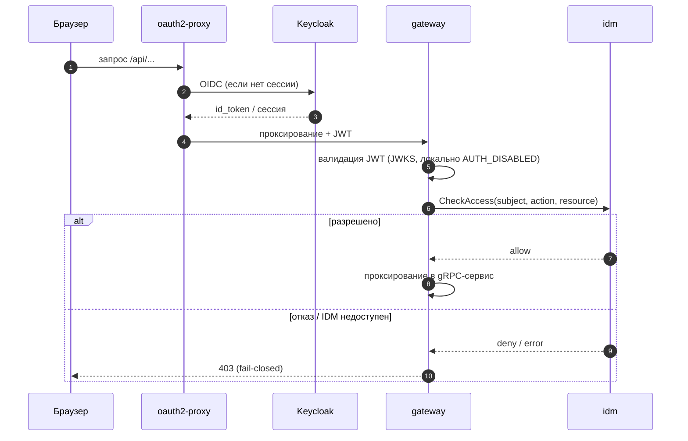
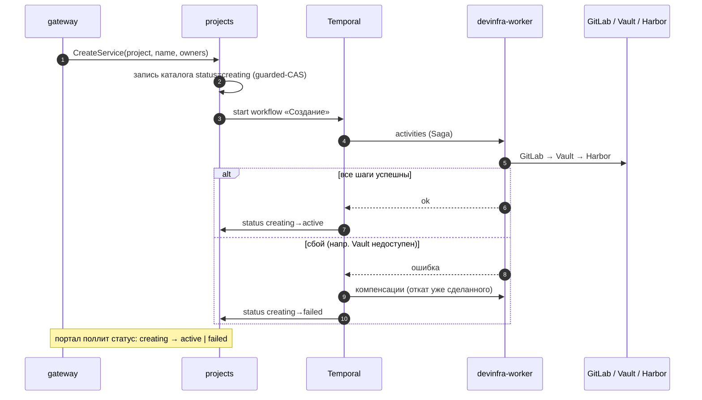

<!-- generated by /doc-it -->
# Архитектура IDP

Обзор архитектуры Internal Developer Platform (MVP) для онбординга: компоненты,
потоки данных, границы доверия, модель аутентификации и карта архитектурных
решений. Детали отдельных решений — в [ADR](adr/) (ссылки по тексту); сценарии и
запуск стенда — в [README.md](../README.md).

## Принципы

- **gRPC/protobuf внутри, OpenAPI/JSON на периметре.** Внутренние вызовы между
  сервисами — gRPC ([ADR-0002](adr/0002-grpc-internal-transport.md)); периметр
  «портал ↔ шлюз» — REST поверх `openapi/openapi.yaml`
  ([ADR-0009](adr/0009-perimeter-rest-resource-shape.md)).
- **Аутентификация fail-closed.** Oauth2-Proxy + Keycloak + per-service JWT;
  отказ или недоступность IDM → `403`
  ([ADR-0003](adr/0003-auth-model.md)).
- **Оркестрация провизии — Temporal.** Долгие рискованные операции —
  Saga-workflow с компенсацией ([ADR-0001](adr/0001-temporal-as-orchestrator.md),
  [ADR-0005](adr/0005-create-saga-rollback-policy.md)).
- **Монорепо на `go.work`.** `pkg` + четыре сервиса + `tests/e2e` в workspace;
  `tools` изолирован ([ADR-0006](adr/0006-go-work-monorepo-layout.md)).
- **Переходы статусов — guarded-CAS** ([ADR-0004](adr/0004-status-transitions-guarded-cas.md)).

## Контекст системы



## Компоненты

| Компонент | Тип | Порты (compose) | Назначение | README / ADR |
|-----------|-----|-----------------|-----------|--------------|
| Портал | SPA (React+Vite+TS) | `3000` | UI создания/наблюдения/IAM; same-origin прокси `/api` | [ADR-0017](adr/0017-portal-design-system-and-ui-architecture.md), [ADR-0022](adr/0022-portal-unified-workflow-progress-source.md) |
| oauth2-proxy | прокси OIDC | `4180` | внешняя аутентификация перед периметром | [ADR-0003](adr/0003-auth-model.md) |
| gateway | Go, HTTP | `8081→8080` | REST-периметр поверх gRPC, проверка JWT + `CheckAccess` | [services/gateway](../services/gateway/) |
| projects | Go, gRPC+HTTP | gRPC `9090`, HTTP `8082` | каталог сервисов, guarded-CAS статусов, запуск Temporal-workflow | [services/projects/README.md](../services/projects/README.md) |
| idm | Go, gRPC+HTTP | gRPC `9090`, HTTP `8081` | RBAC (роли/права/субъекты), `CheckAccess`, справочник из Keycloak | [services/idm/README.md](../services/idm/README.md) |
| devinfra-worker | Go, Temporal worker | HTTP `8083`, queue `devinfra` | activities провизии GitLab/Vault/Harbor (Saga) | [services/devinfra-worker](../services/devinfra-worker/) |
| Temporal | оркестратор | `7233` (UI `8080`) | исполнение и наблюдение workflow | [ADR-0001](adr/0001-temporal-as-orchestrator.md), [ADR-0008](adr/0008-workflow-definition-execution-split.md) |
| Postgres ×2 | БД | `5432` (projects), `5433` (idm) | каталог сервисов / модель RBAC; миграции goose | [ADR-0007](adr/0007-migration-tool-goose.md) |
| DragonflyDB | кэш | `6379` | кэш решений RBAC + кэш идентичностей (TTL) | [ADR-0010](adr/0010-idm-rbac-model-and-cache.md) |
| Keycloak | OIDC | `8088` | выпуск токенов + источник справочника субъектов | [ADR-0003](adr/0003-auth-model.md), [ADR-0016](adr/0016-iam-subject-directory-from-oidc.md) |
| GitLab / Vault / Harbor | внешние | — | целевые системы провизии (локально — wiremock-моки) | [ADR-0019](adr/0019-gitlab-auth-and-namespace-owner-mapping.md)/[0020](adr/0020-vault-auth-and-secret-engine-layout.md)/[0021](adr/0021-harbor-auth-and-project-robot-layout.md) |

## Границы доверия



- **Периметр vs внутренний слой.** За пределы периметра gRPC не выходит; портал
  знает только REST (`openapi/openapi.yaml`). gateway — единственная точка
  трансляции REST↔gRPC и единственное место, где проверяется внешний JWT.
- **Fail-closed RBAC.** gateway вызывает `CheckAccess` перед каждой ручкой;
  `projects` повторяет проверку (defense-in-depth) на критичных операциях
  (decommission/transfer). Отказ/недоступность IDM по любой проверке → `403`.
- **Egress под SSRF-guard.** Все исходящие вызовы к GitLab/Vault/Harbor/Keycloak
  идут через `pkg/ssrf` (`SSRF_DISABLED=true` — только локально для приватных
  http-моков). В Kubernetes слой дополняется Istio mTLS STRICT
  ([ADR-0025](adr/0025-istio-service-mesh-and-secrets.md)).

## Поток аутентификации (периметр)



Локально периметр работает с `AUTH_DISABLED=true` (единственный разрешённый
способ отключения проверки JWT; `AUTH_DISABLED_SUBJECT` даёт детерминированный
`sub`, на который мигрированы сиды RBAC). В проде — реальный JWKS, fail-closed.

## Поток провизии «Создание сервиса» (Saga)



Полная провизия — Saga с компенсацией ([ADR-0005](adr/0005-create-saga-rollback-policy.md));
владельцы обязательны при создании ([ADR-0023](adr/0023-owners-required-at-service-creation.md)).
Жизненный цикл далее: **decommission** (soft delete,
[ADR-0012](adr/0012-decommission-semantics-and-k8s-load-check.md)) и **transfer**
(точка невозврата + двусторонняя авторизация,
[ADR-0013](adr/0013-transfer-semantics-ponr-and-dual-authorization.md)) — см.
[README.md](../README.md) и [services/projects/README.md](../services/projects/README.md).

## Раскладка кода

Монорепо на `go.work` ([ADR-0006](adr/0006-go-work-monorepo-layout.md)); каждый
сервис — отдельный go-модуль.

```
services/gateway          REST-периметр (handlers, IAM-ручки), маппинг gRPC↔HTTP
services/projects         каталог + поддомены: catalog, provisioning, decommission,
                          transfer, changeowners (workflow в отдельных пакетах)
services/idm              RBAC: access/admin/catalog/identity gRPC-серверы
services/devinfra-worker  Temporal worker: activities GitLab/Vault/Harbor
pkg/                      общие библиотеки (см. ниже)
proto/                    .proto контракты (buf codegen)
openapi/openapi.yaml      источник правды периметра (TS-клиент + zod)
web/                      портал (React + Vite + TS)
deploy/                   compose-стенд, Helm-чарты, Istio, моки
```

Ключевые общие пакеты `pkg/`: `auth` (JWT/JWKS), `grpcx` (gRPC-обвязка),
`httpserver`/`httpclient`, `db` (Postgres/goose), `ssrf` (egress-guard), `errs`
(маппинг ошибок→коды), `config`, `logger`, `reqid`, `temporallog`, `api`
(сгенерированные периметровые типы).

## Деплой

- **Локально** — `deploy/compose/docker-compose.yml` (полный стенд, см. README).
- **Kubernetes** — Helm umbrella-чарт `deploy/helm/idp` + library-chart
  `deploy/helm/idp-lib`, overlay `values-local/prod`; сетевой слой — Istio
  (Gateway/VirtualService/mTLS STRICT), секреты — нативные k8s Secret
  ([ADR-0024](adr/0024-helm-deployment-packaging.md),
  [ADR-0025](adr/0025-istio-service-mesh-and-secrets.md)). Артефакты
  валидируются без кластера: `make helm`.

## Карта ADR по областям

| Область | ADR |
|---------|-----|
| Транспорт и периметр | 0002, 0009 |
| Аутентификация и RBAC | 0003, 0010, 0014, 0015, 0016 |
| Оркестрация и статусы | 0001, 0004, 0008 |
| Жизненный цикл сервиса | 0005, 0011, 0012, 0013, 0023 |
| Интеграции | 0019 (GitLab), 0020 (Vault), 0021 (Harbor) |
| Портал | 0017, 0022 |
| Платформа / репо | 0006, 0007 |
| Деплой | 0024, 0025 |
| E2E | 0018 |

Полный индекс с датами — [docs/README.md](README.md).
